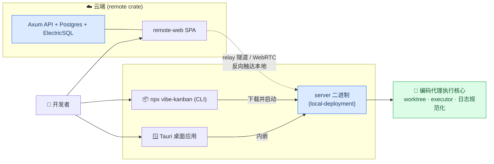
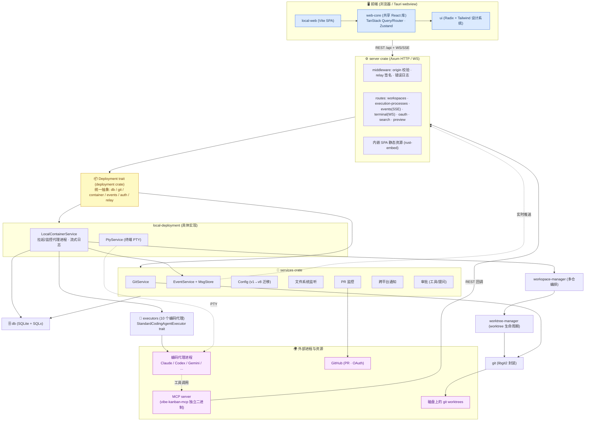
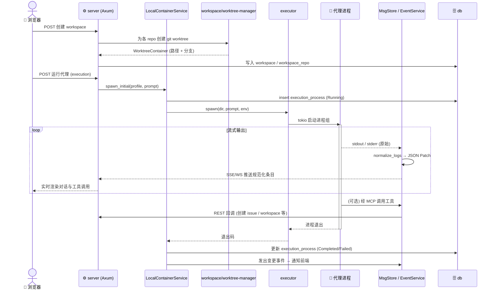
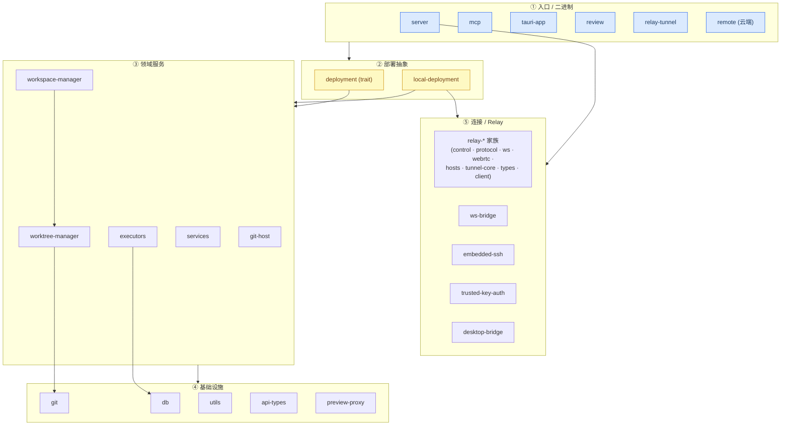
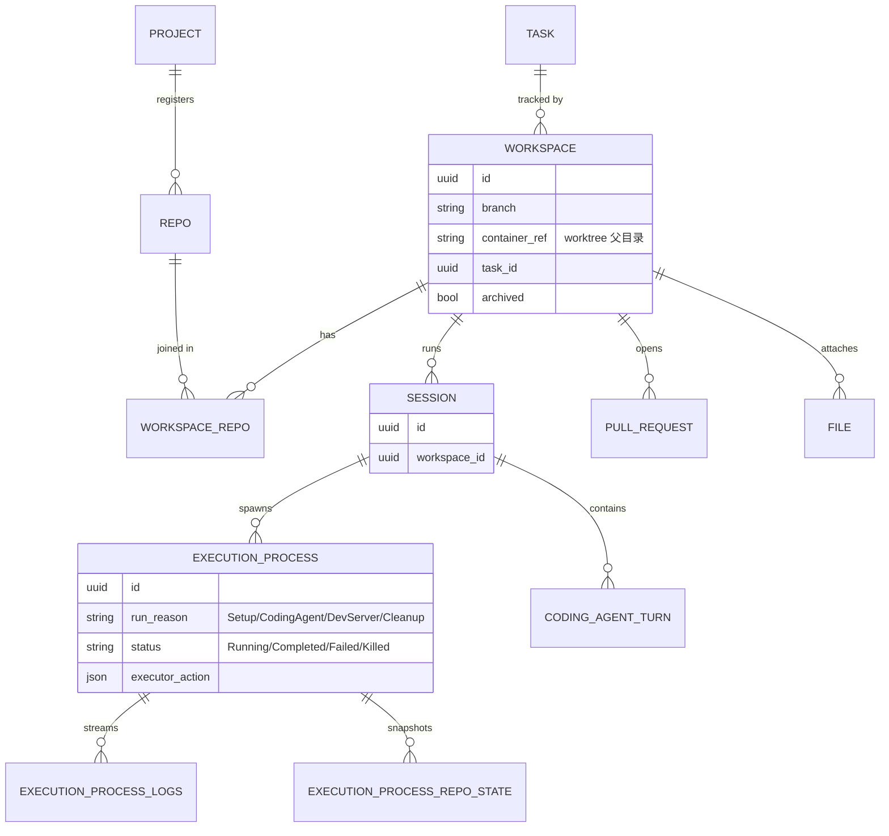
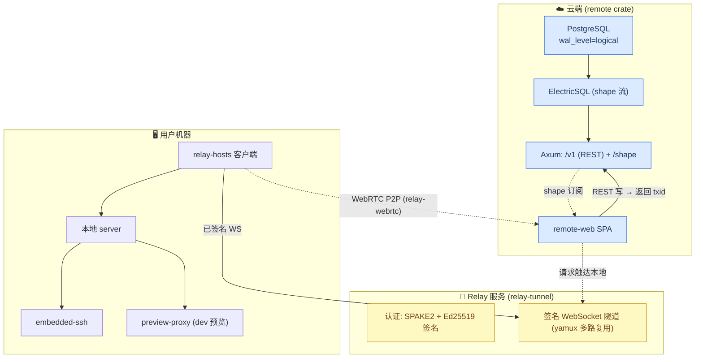

# Vibe Kanban 架构总览

Vibe Kanban 是一个用看板(Kanban)来**规划、运行、审查多个 AI 编码代理**(Claude Code / Codex / Gemini CLI / Copilot / Amp / Cursor / OpenCode / Droid / CCR / Qwen 等 10+)的平台。核心机制是:每个 "workspace" 给代理一个独立的 git worktree、终端和 dev server,代理在其中执行,日志被规范化后实时流式推送到前端,人审查 diff、留评论、最终开 PR 合并。

它是一个 **Rust workspace(30+ crates)+ pnpm 前端 monorepo**,通过 `ts-rs` 在 Rust 与 TypeScript 之间共享类型。整个系统围绕一个 `Deployment` trait 做抽象,有 **本地(local)** 和 **云端(remote)** 两套实现。

> 注:仓库 README 顶部已挂出 "Vibe Kanban is sunsetting" 公告,但代码结构仍完整。本文件为面向开发者的架构参考,所有图均为 Mermaid 源文本,可在 GitHub / VS Code 原生渲染。

---

## 🗺️ 三种部署形态(系统上下文)

_展示同一套"编码代理执行核心"如何通过本地 CLI、Tauri 桌面应用、云端三种形态对外提供,以及云端如何借助 relay 反向触达本地实例。_

---

## 🏛️ 本地运行时架构(核心)

这是整个项目最重要的一张图:前端 → Axum 服务 → `Deployment` trait → 各服务 → git worktree 与代理进程。

_本地形态下,前端经 REST 与 WS/SSE 与 server 通信;server 把请求转发给 `Deployment` trait;`LocalContainerService` 驱动 executor 拉起编码代理进程,代理又通过 MCP 反向调用 server。_

---

## ⏱️ 一次代理运行的时序

_从创建 workspace 到代理执行、日志规范化、实时流式推送、再到进程退出的完整生命周期。_

---

## 🧱 后端 crate 分层与依赖

_按职责把 30+ 个 crate 分为入口二进制、部署抽象、领域服务、基础设施、连接/relay 五层,依赖方向自上而下。_

---

## 🗄️ 领域数据模型(SQLite)

_本地数据库的核心实体与关系:项目/仓库 → workspace(多仓 worktree 容器)→ session → 执行进程 → 日志,以及任务、PR、附件。_

---

## ☁️ 云端 + Relay 拓扑

_云端用 Postgres + ElectricSQL 做读路径实时同步、REST 写入并回传 txid;relay 隧道让云端前端经签名 WebSocket / WebRTC 反向触达用户本地实例。_

---

## 🔑 关键设计要点

| 主题 | 做法 |
|------|------|
| **统一抽象** | `Deployment` trait 把 db / git / container / events / auth / relay 收拢成一个接口,`local-deployment` 与 `remote` 两套实现可互换 |
| **代理可插拔** | `StandardCodingAgentExecutor` trait + `#[enum_dispatch]`,每个代理一个 `.rs`;输出统一规范化为 `NormalizedEntry`(消息/工具调用/思考/token 用量) |
| **实时流** | `MsgStore`(内存环形缓冲 + broadcast)→ SSE/WebSocket,日志用 **RFC 6902 JSON Patch** 增量推送 |
| **隔离执行** | 每个 workspace 用 `worktree-manager` 创建独立 git worktree;多仓由 `workspace-manager` 原子编排、失败回滚 |
| **类型共享** | `ts-rs` 从 Rust 结构体生成 `shared/types.ts`(本地)与 `shared/remote-types.ts`(云端),禁止手改 |
| **前端复用** | `web-core` 为共享逻辑(TanStack Query/Router + Zustand),`local-web` / `remote-web` 仅为入口,通过 `runtime="local"/"remote"` 分支行为 |
| **连接安全** | relay 链路用 SPAKE2 密码认证 + Ed25519 请求签名;`embedded-ssh` 校验公钥;优先 WebRTC P2P,失败回退隧道 |

---

## 📁 关键路径索引

| 组件 | 路径 |
|------|------|
| Server 入口 | `crates/server/src/main.rs` · `crates/server/src/routes/mod.rs` |
| Deployment trait | `crates/deployment/src/lib.rs` |
| 本地实现 | `crates/local-deployment/src/lib.rs` · `container.rs` · `pty.rs` |
| 编码代理 | `crates/executors/src/executors/mod.rs` + `{claude,codex,gemini,...}.rs` |
| 日志规范化 | `crates/executors/src/logs/` |
| 领域服务 | `crates/services/src/services/` |
| 数据模型 / 迁移 | `crates/db/src/models/` · `crates/db/migrations/` |
| worktree / 多仓 | `crates/worktree-manager/` · `crates/workspace-manager/` |
| MCP server | `crates/mcp/src/bin/vibe_kanban_mcp.rs` |
| 云端 | `crates/remote/`(详见 `crates/remote/AGENTS.md`) |
| 前端共享逻辑 | `packages/web-core/src/`(API: `shared/lib/api.ts`) |
| 前端入口 | `packages/local-web/` · `packages/remote-web/` · 设计系统 `packages/ui/` |
| CLI | `npx-cli/src/cli.ts` |

> 一处待核实点:`crates/remote/AGENTS.md` 描述了 ElectricSQL shape 流 + REST 写回 txid 握手的读写契约(本图据此绘制);但 `remote-web` 前端的 `package.json` 中未直接发现 Electric 客户端依赖。云端前端究竟走 Electric 订阅还是 REST 轮询,需进一步核对 `packages/remote-web`。
