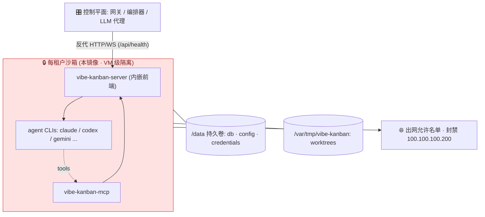

# Vibe Kanban 沙箱模块

**每租户运行一个隔离的 vibe-kanban 实例 + 编码 agent**,让 SaaS 能安全地把"互不信任的用户"放上来、各自启动服务端编码 agent。

vibe-kanban 在设计上是**单租户**的(一个 SQLite 库、一份带 OAuth 令牌的 `~/.local/share` 配置、一套 worktrees)。因此正确的多租户模型是**每租户一个沙箱实例**,绝不是共享一个进程。本模块把"那个实例"打包成一个硬化镜像,并给出编排器必须遵守的运行时契约。

> 编码 agent 会执行任意 shell 命令——按**运行不可信代码**对待。镜像负责硬化容器,但容器只是边界的一半;另一半(VM 级运行时 + 出网过滤)取决于你**怎么运行**它。见[安全模型](#安全模型)。

## 相比官方镜像本模块补了什么

仓库自带的 `../Dockerfile` 把 `server` 二进制构建到 `debian:bookworm-slim` 上——但那个镜像**没有 Node、没有任何 agent CLI**,所以根本跑不了编码 agent。本模块的运行阶段补上:

- Node 20 运行时 + 预装 **claude-code + codex** 两个编码 agent CLI(executor 用 `npx` 拉起;med-research 主用这两个,其余 gemini/copilot/amp/opencode/qwen 按需在 Dockerfile 加);
- `vibe-kanban-mcp` 工具服务二进制;
- 非 root、只读根、drop caps 等硬化;
- `/data` + `/var/tmp/vibe-kanban` 卷契约(状态 vs worktrees);
- 正确的 `/api/health` 健康检查。

## 文件清单

| 文件 | 用途 |
|---|---|
| `Dockerfile` | 三阶段构建:前端 → Rust 二进制 → 硬化 Node 运行时 |
| `entrypoint.sh` | 运行时初始化:建目录、git 身份、Origin 校验、exec server |
| `run-local.sh` | P0 单租户冒烟测试(`RUNSC=1` 走 gVisor) |
| `egress.nft` | 主机 nftables 模板:默认拒绝出网 + 封禁元数据 |
| `k8s/pod-template.yaml` | P1 每租户 Pod(ACK 安全沙箱 / ECI) |
| `k8s/networkpolicy.yaml` | P1 默认拒绝出网 + 仅网关入站 |

## 架构



## 构建与运行(P0)

构建上下文是**仓库根目录**(镜像会 COPY `crates/`、`packages/` 等):

```bash
# 在仓库根目录执行
docker build -f sandbox/Dockerfile -t vibe-kanban-sandbox:latest .

# 启动一个硬化租户(装好 gVisor 后加 RUNSC=1;公开上线前必须启用)
RUNSC=1 VK_ALLOWED_ORIGINS=http://localhost:8080 ./sandbox/run-local.sh demo
# 浏览器打开 http://localhost:8080
```

确认仓库根的 `.dockerignore` 排除了 `target/`、`**/node_modules`、`dev_assets*/`(保持构建上下文精简),且**没有**排除 `sandbox/`。

## 卷契约(编排器必须满足)

vibe-kanban 的数据落点通过环境变量重定向,以便根文件系统保持只读。已对照代码核实(`utils::asset_dir` / `cache_dir`、`db::lib`、`worktree_manager`):

| 容器内路径 | 重定向方式 | 内容 | 持久 | 保密 |
|---|---|---|---|---|
| `/data/state` | `XDG_DATA_HOME` | **`db.v2.sqlite`、`config.json`、`credentials.json`(OAuth)、签名私钥、执行日志** | ✅ | 🔴 |
| `/data/cache` | `XDG_CACHE_HOME` | 附件 | ✅ | 中 |
| `/data/home` | `HOME` | agent CLI 状态/认证(`~/.claude` 等)、npm 缓存 | ✅ | 🔴 |
| `/var/tmp/vibe-kanban` | worktree 基目录 | git worktrees = agent 改的源码 + dev server | 长驻 ✅ / 短任务 = scratch | 中 |
| `/tmp` | `TMPDIR` | 临时 | ❌ tmpfs(noexec) | — |

两条铁律:**(1)** `/var/tmp/vibe-kanban` 必须是真实、**可执行**的卷(绝不能是 `noexec` 的 tmpfs)——agent 在里面跑脚本和 dev server;**(2)** `/data/state` 含 OAuth 令牌和整个数据库,严格**每租户独立、绝不共享**。

短任务 → 把 `/data` + `/var/tmp/vibe-kanban` 挂成 scratch(`emptyDir`),用完即毁。长驻环境 → 两者都用每租户 PVC/NAS 持久化。

## 安全模型

| 层 | 控制项 | 在哪 |
|---|---|---|
| **进程/内核** | 不可信公开用户用 gVisor(`runsc`)或 Kata microVM | 运行时,非镜像 |
| 容器 | 非 root uid 10001、只读根、`cap-drop ALL`、`no-new-privileges`、seccomp | 镜像 + 运行参数 |
| 资源 | cpu/内存/pids/磁盘 限额(防吵闹邻居 + DoS) | 运行参数 / Pod limits |
| 网络 | 每租户独立网络、默认拒绝出网 + 允许名单 | `egress.nft` / NetworkPolicy |
| **元数据** | **封禁 `100.100.100.200`** + 零权限 RAM 角色 | `egress.nft` / NetworkPolicy + 云 IAM |
| 密钥 | 仅每租户;LLM key 走代理(`*_BASE_URL`),绝不进沙箱 | 编排器 |
| 落盘加密 | `/data` PVC 必须用**加密**存储类——`db.v2.sqlite` + `credentials.json` 明文落盘 | 编排器 |
| Origin | `VK_ALLOWED_ORIGINS` = 租户网关 Origin(否则 403) | `entrypoint.sh` |

> 阿里云的元数据端点是 `100.100.100.200`(不是 AWS/GCP 的 `169.254.169.254`)。暴露不可信用户前,封禁它 + 零权限 RAM 角色是强制项。

## 运行时出网:agent 经 `npx` 拉取

executor 用 `npx -y <pkg>@<version>` 启动 agent。把这些精确版本全局预装(已在 `Dockerfile` 里做)能加速启动,但 **`npx -y` 每次仍会联系 npm registry**——全局安装不会填充 npx 缓存。所以在锁定出网时,你**必须**二选一:

1. **放行 npm registry**(`registry.npmjs.org`,或国内 `registry.npmmirror.com`)于 `egress.nft` / 出网代理——最简单;registry 是良性目标。k8s NetworkPolicy 已放行公网 443(已排除元数据 + 私网段),那边天然可用。
2. **覆盖各 executor 的 `base_command`**(vibe-kanban 配置项 `base_command_override`),直接调预装的全局二进制(如用 `claude` 代替 `npx … claude-code`)——完全离线,但需逐 agent 配置。

二者都不做,agent 在完全锁定出网的沙箱里会起不来。

> 健康检查说明:`/api/health` 开箱可用。relay 签名与 Origin 两个中间件对"不带 relay 头、不带 `Origin` 头"的请求都直接放行(已在 `crates/server/src/middleware/` 核实),所以本地 `curl` 和 k8s httpGet 探针都能拿到 200。(裸 `/health` 只能经 relay 访问,因此用 `/api/health`。)

## 上线路径

| 阶段 | 隔离底座 | 准入 |
|---|---|---|
| **P0 内测** | 现有 ECS + gVisor + 全套硬化 + 每租户网络 | 邀请制,**不公开** |
| **P1 公开** | ACK 安全沙箱(Kata)/ ECI(VM 级)+ 出网允许名单 + LLM 代理 + 配额 | 开放注册 |
| **P2 规模化** | 预热池(冷启动)、NAS 快照、自动扩缩、滥用检测 | 增长期 |

P1 选阿里云托管 microVM 的原因:标准 ECS 无嵌套虚拟化,自建 Firecracker/Kata 需要裸金属;ACK 安全沙箱 / ECI 由阿里云托管底层虚拟化、提供 VM 级隔离。同一镜像,零返工。

> 强制 VM 级隔离、防止被悄悄降级:给租户命名空间打标签 `pod-security.kubernetes.io/enforce: restricted`,并加准入 webhook 拒绝任何缺少 `runtimeClassName: sandboxed` 的 Pod。`run-local.sh` 在 `RUNSC` 未设时会大字告警(纯 runc = 开发/测试,绝不用于不可信公开)。

## 本模块**不包含**的部分(需另建)

- **控制平面**:网关/认证、编排器(拉起 + 路由 + 回收)、租户注册表、配额/计费。
- **LLM 代理**:注入真实上游 key,按租户限额。
- **用户项目的语言工具链**(python/go/jvm 等):本基础镜像只有 Node + git + ripgrep。按需添加,或叠一层 devcontainer 风格镜像。
- **快照/恢复**以加速冷启动(Firecracker 原生;ECI 经 NAS 重挂)。

## 维护

- `Dockerfile` 里的 agent CLI 版本对应 `crates/executors/src/executors/*.rs` 里的 base command——每次 vibe-kanban 升级都要同步(如 `Bump Codex to 0.124.0` 那类改动)。
- 若某个全局 `npm install` 因 native 构建失败,给该阶段加 `python3` + `build-essential`,或去掉该 agent、改在运行时用 `npx` 并把 npm registry 放进出网允许名单(`registry.npmjs.org` 或 `registry.npmmirror.com`)。
- **构建架构必须匹配部署架构。** 部分 CLI(codex、cursor)发的是按架构预编译的二进制;按目标架构构建镜像(如阿里云 ECS 是 x86_64 就用 `docker buildx build --platform linux/amd64`,arm ECS 用 `linux/arm64`),不要依赖本机架构。
- vibe-kanban 升级后,复核 `utils::path::get_vibe_kanban_temp_dir()`(worktree 基目录)与 `utils::asset_dir()`(状态目录)路径未变。
```

